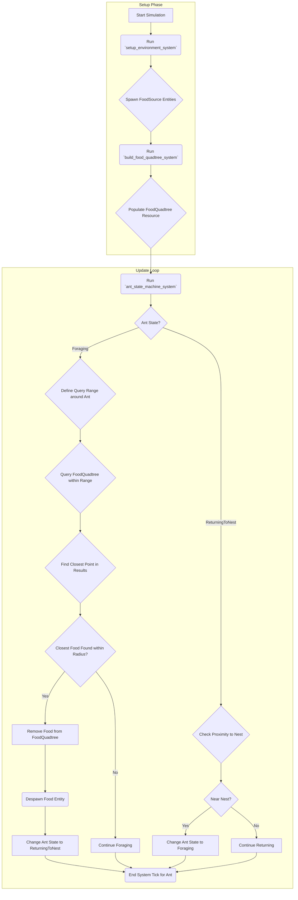

# Plan: Custom Quadtree for Food Lookup Optimization

**Phase:** 1
**Goal:** Replace the O(M*N) food lookup (where M=ants, N=food) with an efficient custom Quadtree-based spatial query, suitable for potentially non-uniform food distributions (e.g., from food generators).

## Key Components &amp; Implementation Steps

1.  **Quadtree Data Structure:**
    *   Implement a `QuadTreeNode` struct/enum representing nodes (Internal or Leaf).
    *   Nodes store their `boundary` (Rect), `points` (Vec<(Entity, Position)> - primarily in leaves), and potentially `children` (for internal nodes).
    *   Define a `capacity` parameter (max points per leaf before subdivision) and potentially a `max_depth`.

2.  **Bevy Resource:**
    *   Create a `FoodQuadtree` resource holding the root `QuadTreeNode` and world boundary information.
    *   Register with `.init_resource::<FoodQuadtree>()` in the Bevy App setup.

3.  **Population System (`build_food_quadtree_system`):**
    *   **Schedule:** Runs once during setup (e.g., in `Startup` stage, *after* `setup_environment_system`).
    *   **Inputs:** `mut food_quadtree: ResMut<FoodQuadtree>`, `query_food: Query<(Entity, &amp;Position), With<FoodSource>>`.
    *   **Logic:**
        *   Initializes the Quadtree resource with the world boundaries.
        *   Iterates through all `FoodSource` entities.
        *   Inserts each `(Entity, Position)` into the Quadtree using recursive descent and subdivision logic based on `capacity`.

4.  **Query Logic (in `ant_state_machine_system`):**
    *   **Schedule:** Runs in the main update schedule (e.g., `Update` stage).
    *   **Inputs:** Modify the system to take `food_quadtree: Res<FoodQuadtree>` (or `ResMut` if deletion happens here). Remove the old `Query<(Entity, &amp;Position), With<FoodSource>>`.
    *   **Logic (for `Foraging` ants):**
        *   Define the query range (e.g., a circle or square centered on the ant with size related to `INTERACTION_RADIUS`).
        *   Call a `query_range(&amp;self, range: RectOrCircle)` method on the `FoodQuadtree` resource.
        *   The `query_range` method recursively traverses the tree:
            *   Prunes branches whose boundaries don't intersect the query range.
            *   Collects points from intersecting leaf nodes that fall within the actual query range.
        *   Find the closest point (`closest_food_entity`) among the results returned by `query_range`.
        *   If `closest_food_entity` is within `INTERACTION_RADIUS`: proceed to removal/despawn logic.

5.  **Deletion Logic (in `ant_state_machine_system` or separate system):**
    *   **Trigger:** When a foraging ant finds food within interaction radius.
    *   **Inputs:** Requires `mut food_quadtree: ResMut<FoodQuadtree>` and `commands: Commands`. Needs the `Entity` and `Position` of the food to be removed.
    *   **Logic:**
        *   Implement a `remove(&amp;mut self, entity: Entity, position: &amp;Position)` method on the Quadtree.
        *   This method traverses the tree to find the correct leaf based on the position.
        *   Removes the `(Entity, Position)` pair from the leaf's `points` vector.
        *   (Optional: Skip complex node merging logic for simplicity).
        *   Call this `food_quadtree.remove(found_entity, found_position)` method *before* despawning the entity.
        *   Despawn the entity using `commands.entity(found_entity).despawn()`.

6.  **System Ordering:**
    *   Ensure `build_food_quadtree_system` runs once in `Startup` after `setup_environment_system`.
    *   Ensure `ant_state_machine_system` runs in `Update`.

## Mermaid Diagram

## Considerations for Phase 2 (Pheromones)

*   The Quadtree structure *can* be adapted for dynamic pheromones.
*   This would require frequent insertions (`pheromone_deposit_system`) and removals (`pheromone_decay_system`).
*   The performance of these frequent updates, especially removals without merging, should be considered during Phase 2 planning.